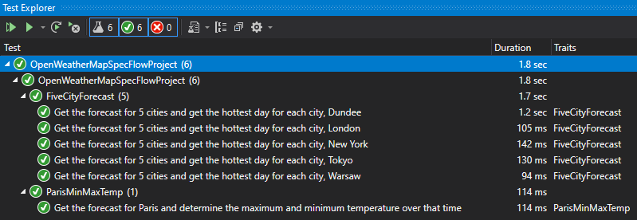
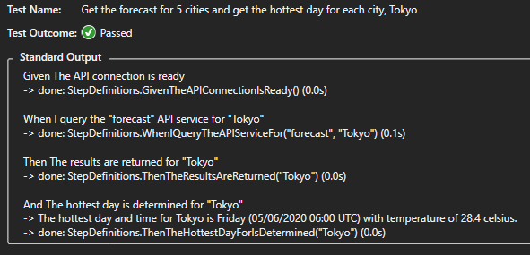

# OpenWeatherMapSpecFlow

## Running the Tests

To run the tests please open the solution in Visual Studio 2019, compile it and open the **Test Explorer**.

Click **Run All Tests**. In case of running of the first time you will need to setup your SpecFlow account (see https://specflow.org/getting-started/ for details).



In case of problems you might need to set the `MSBUILDSINGLELOADCONTEXT` environment variable in your system to **1**:
```
# When using Git Bash or any Linux terminal
export MSBUILDSINGLELOADCONTEXT=1
```

   Open additional output for this result
You can find the reults for the specific tests from the **Tests Explorer** when you click on "Open additional output for this result":


The information we're looking for will be displayed at the bottom of the test run output:
```
 The hottest day and time for Tokyo is Friday (05/06/2020 06:00 UTC) with temperature of 28.4 celsius.
```

## Estimated completion time

Approx. 12-16 hours spread across a few evenings

## What is good?

* Good separation of responsibilities (feature files, steps, handlers, data models)
* Reusable steps for other scenarios

## What could be done to make this better?

* Getting the tests running in an Azure DevOps Pipeline with results posted in Slack/Teams/etc
* Unit testing the data processing logic (internal test project)
* Scenario context injection so that steps from different step definition classes can use it
* Display result time in the console for specific Time Zones rather than UTC

## Most interesting trends in test automation

* Using serverless CI/CD platforms (e.g. Microsoft Azure DevOps, CircleCI with custom Docker images) to run automated suites.
* Building automated deployment/testing pipelines with repeatable environments
* Getting development, QA and project management teams closer by use of BDD and visibility of test results through automated tools and chat systems such as Slack
* Testing REST APIs using Postman/Newman

## Mirek described in JSON

```
{
    "name": "Miroslaw Majka",
    "nickname": "Mirek",
    "location": "Dundee"
    "linkedInUrl": "https://www.linkedin.com/in/miroslaw-majka-nodejs/",
    "favouriteTechnlogies": [
        {
            "domain": "programming",
            "list": [
                "dotnet",
                "csharp"
                "node.js"
            ]
        },
        {
            "domain": "automation",
            "list": [
                "azuredevops",
                "teamcity",
                "selenium",
                "webdriverio"
            ]
        }
    ] 
}
```